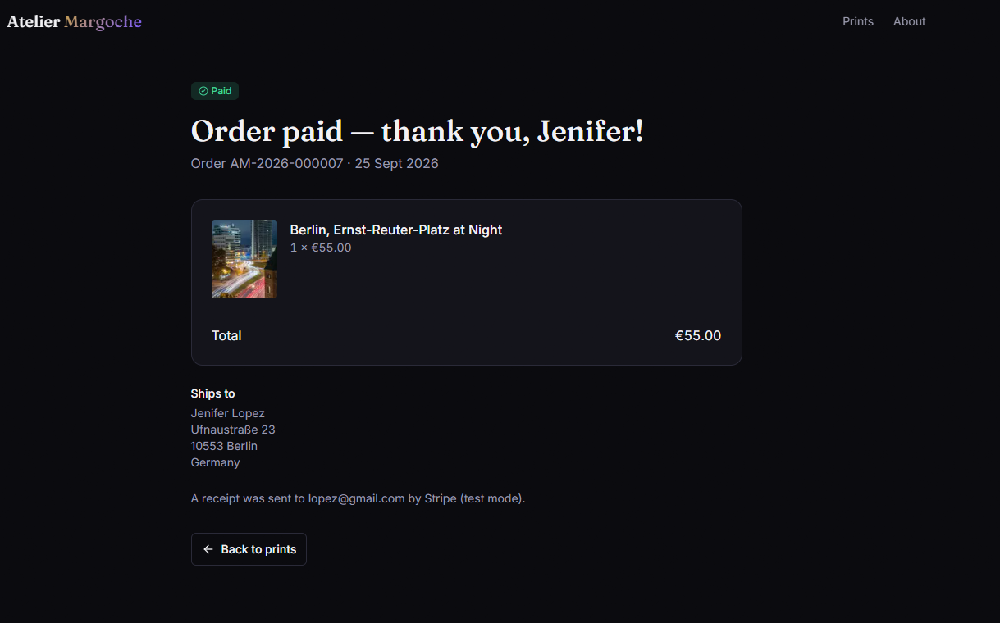
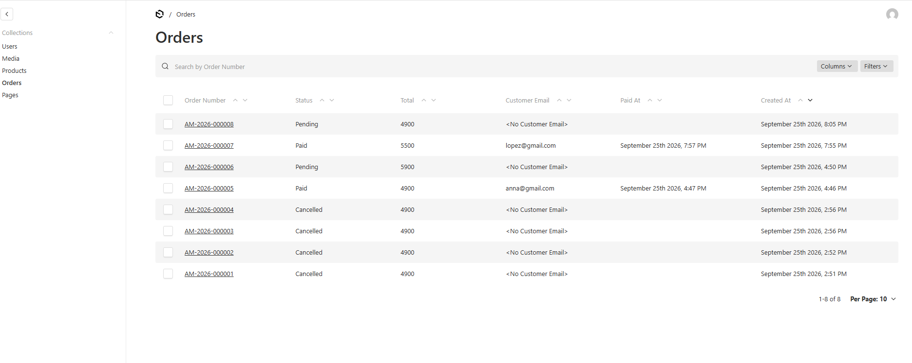
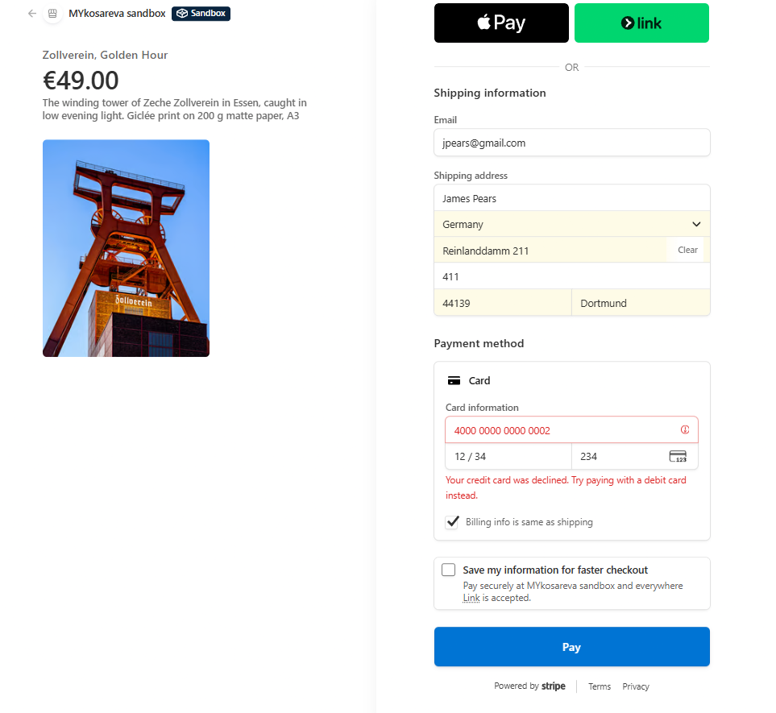

# Atelier Margoche

A small online shop for art prints — photographs and AI-generated artworks — with an owner-editable catalogue and Stripe checkout.

**Live:** https://atelier-margoche-shop.vercel.app


## How it works

- The owner edits products and pages in the Payload admin; changes go live within a minute, with no redeploy.
- "Buy now" opens Stripe's hosted Checkout in sandbox (test) mode — no real money moves.
- An order is marked paid only by the Stripe webhook, after its signature is verified — never by the thank-you page.
- A declined card leaves the order `pending`; nothing is marked paid.

<p>
  
  
</p>



*Card 4000 0000 0000 0002 is declined on Stripe's page; the order stays `pending`.*

## Owner guide

Log in at [/admin](https://atelier-margoche-shop.vercel.app/admin) with email and password.

- **Products** — title, slug, price (in cents), short description, image, kind (Photo / AI art). Tick **Sold out** and the product page shows "Sold out" instead of Buy now; the catalogue card gets a badge.
- **Pages** — About, Impressum, Privacy, Terms & Returns: title, slug, rich-text content. The four legal pages can be edited but not deleted.
- **Media** — uploaded images are stored in Vercel Blob (JPEG, PNG or WebP, up to 8 MB).
- **Orders** — every checkout with status (`pending`, `paid`, `cancelled`), items, total, customer email and shipping address; the owner can add a note. Orders are created by the server only.

Reviewers need no credentials: the demo runs on a screen-shared call, and if admin access is requested the owner creates a temporary `reviewer@…` user and deletes it afterwards.

## Run locally

Requires Node ≥ 20 and the [Stripe CLI](https://docs.stripe.com/stripe-cli).

```bash
cp .env.example .env      # then fill in the values (see below)
npm install
npm run migrate
npm run seed
npm run dev               # http://localhost:3000
```

On first start, open http://localhost:3000/admin and create the first admin user.

```bash
stripe listen --events checkout.session.completed,checkout.session.expired --forward-to localhost:3000/next/stripe/webhook
```

## Environment variables

| Name | Where to get it |
|---|---|
| `DATABASE_URI` | Supabase → Project Settings → Database → Connection string (URI) |
| `PAYLOAD_SECRET` | Any 32+ random characters, e.g. `openssl rand -hex 32` |
| `NEXT_PUBLIC_SERVER_URL` | `http://localhost:3000` locally; `https://atelier-margoche-shop.vercel.app` on Vercel |
| `STRIPE_SECRET_KEY` | Stripe Dashboard (Test mode) → Developers → API keys → Secret key (`sk_test_…`) |
| `STRIPE_WEBHOOK_SECRET` | Locally: printed by `stripe listen`. Vercel: Developers → Webhooks → endpoint → Signing secret (`whsec_…`) |
| `BLOB_READ_WRITE_TOKEN` | Vercel → Storage → Blob store (injected automatically when linked). Leave empty locally: uploads go to `media/` |

Use the Supabase **Session pooler** URI (port 5432) locally and the **Transaction pooler** URI (port 6543) on Vercel. The app refuses to start unless the Stripe key starts with `sk_test_`.

## Deployment

- Vercel project connected to this GitHub repository; env variables set for Production and Preview.
- Build command `npm run ci` (`payload migrate && next build`), so migrations apply on every deploy.
- A Vercel Blob store is linked to the project, and a Stripe webhook endpoint points at `https://atelier-margoche-shop.vercel.app/next/stripe/webhook` (events `checkout.session.completed`, `checkout.session.expired`).

## Optional tasks delivered

- Orders collection
- Order confirmation page (`/order/[orderId]`)
- Sold-out state
- Second collection: Pages
- Written go-live plan — [docs/GO-LIVE-PLAN.md](docs/GO-LIVE-PLAN.md)

Planned: cart, per-product mockup image, digital downloads.

## Test cards

Success: `4242 4242 4242 4242` · Decline: `4000 0000 0000 0002`.
Any future expiry date, any CVC, any postcode.

## Stack

Next.js (App Router, TypeScript) · Payload 3 · Supabase Postgres · Vercel Blob · Stripe Checkout · Tailwind v4 + shadcn/ui · Zod · Vitest + Playwright · Vercel — built with the Payload skills and the Stripe Claude Code plugin installed beforehand.
